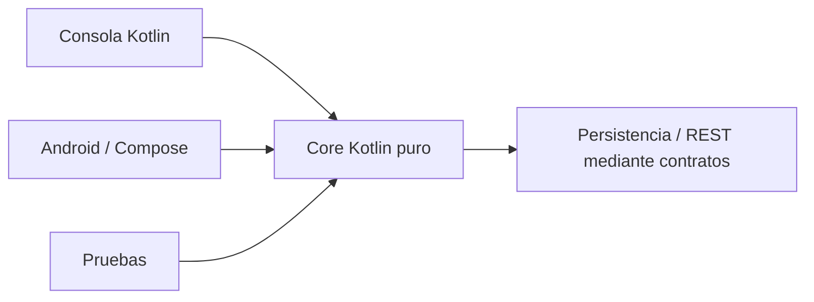

# DSY1105 · Desarrollo de Aplicaciones Móviles · 2026-2

Repositorio de apoyo para la asignatura **DSY1105 Desarrollo de Aplicaciones Móviles**.

Este repositorio reúne contenido de clases, ejemplos, ejercicios, guías y recursos complementarios utilizados durante el semestre 2026-2 para la sección **DSY1105-009V**.

## Acceso rápido

- [`semanas/`](semanas/) — índice y contenido consolidado de cada semana.
- [`proyecto-formativo/`](proyecto-formativo/) — **PocketLog**, proyecto formativo transversal que evoluciona desde Kotlin consola hacia Android, persistencia, REST y pruebas.
- [`docs/`](docs/) — índice de conocimientos y guías transversales reutilizables durante el semestre.
- [`labs/`](labs/) — índice de ejercicios y laboratorios prácticos, manteniendo cada laboratorio dentro de su semana de origen.
- [`examples/`](examples/) — índice de ejemplos de código desarrollados en clases.
- [`page/`](page/) — base del portal web del curso; se habilitará progresivamente.
- [**Material público del curso**](https://drive.google.com/drive/folders/1_Ew_IE0InqJbPY0Ggu8p0cHl4Avv3rYs?usp=sharing) — biblioteca de archivos originales organizada semana a semana.

## Proyecto formativo transversal

Durante el semestre se utiliza **PocketLog** como hilo conductor formativo.

La lógica creada inicialmente con Kotlin de consola debe poder evolucionar sin ser reescrita al incorporar Android:



La arquitectura se introduce progresivamente, cuando cada concepto resulte necesario. PocketLog se pausa en semanas de evaluación para evitar convertir el proyecto formativo en una pauta indirecta de las evaluaciones sumativas.

→ [Ver proyecto PocketLog](proyecto-formativo/)  
→ [Ver diseño longitudinal](docs/PROYECTO-FORMATIVO-TRANSVERSAL.md)

## Cómo se organiza el material

Cada semana mantendrá dos fuentes complementarias:

### Contenido consolidado

Se publica en este repositorio dentro de `semanas/semana-XX/`.

El contenido consolidado incorpora:

- los contenidos definidos para la semana;
- explicaciones y ejemplos;
- contexto técnico adicional;
- aclaraciones cuando el material institucional presenta ambigüedades, inconsistencias o información que requiere actualización;
- ejercicios, laboratorios y evidencias cuando corresponda.

El directorio [`semanas/`](semanas/) mantiene un **README general** que funciona como índice del semestre. Además, cada carpeta semanal mantiene su propio `README.md` como punto de entrada a esa semana.

Los directorios [`docs/`](docs/), [`labs/`](labs/) y [`examples/`](examples/) funcionan como **índices transversales**. El material principal no se duplica: permanece en la semana donde fue utilizado y estos índices facilitan encontrarlo después.

### Material original

Los archivos institucionales se mantienen como fuente de referencia en la [biblioteca pública de Google Drive](https://drive.google.com/drive/folders/1_Ew_IE0InqJbPY0Ggu8p0cHl4Avv3rYs?usp=sharing) y se organizan semana a semana para su consulta. El repositorio no reemplaza AVA ni los recursos oficiales; los complementa con el material consolidado utilizado efectivamente en clases.

## Cómo obtener el repositorio

```bash
git clone https://github.com/cmartinezs/DSY1105-DESARROLLO-APLICACIONES-MOVILES-2026-2.git
cd DSY1105-DESARROLLO-APLICACIONES-MOVILES-2026-2
```

Para actualizar una copia existente:

```bash
git pull
```

## Organización del semestre

El curso avanza progresivamente desde fundamentos de Kotlin y el ecosistema móvil, hacia desarrollo de interfaces y funcionalidades nativas, persistencia, consumo de APIs REST, pruebas y empaquetado de aplicaciones.

## Semana actual

**Semana 2 · 17 al 22 de agosto de 2026**

Actividad institucional: **1.2 Programación de Kotlin y sus fundamentos**.

- 1.2.1 Programación en Kotlin y sus fundamentos.
- 1.2.2 Guía 2: Aplicando Kotlin básico.
- 1.2.3 Colecciones y funciones en Kotlin.
- 1.2.4 Guía 3: Aplicando colecciones.
- Inicio de PocketLog como checkpoint Kotlin reutilizable durante el semestre.

Consulta el contenido en [`semanas/semana-02/`](semanas/semana-02/).

---

> AVA continúa siendo la plataforma oficial para comunicaciones, actividades y recursos institucionales que deban gestionarse desde el entorno académico.
