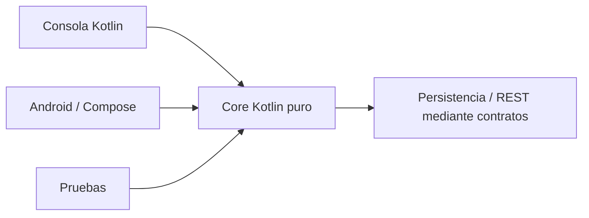

# DSY1105 · Desarrollo de Aplicaciones Móviles · 2026-2

Repositorio de apoyo para la asignatura **DSY1105 Desarrollo de Aplicaciones Móviles**, sección **009V**.

## Acceso rápido

- [`semanas/`](semanas/) — índice y contenido consolidado de cada semana.
- [`proyecto-formativo/`](proyecto-formativo/) — **PocketLog**, proyecto formativo transversal.
- [`docs/`](docs/) — conocimientos y guías transversales.
- [`labs/`](labs/) — laboratorios prácticos.
- [`examples/`](examples/) — ejemplos de código desarrollados en clases.
- [**Sitio web de la asignatura**](https://cmartinezs.github.io/DSY1105-DESARROLLO-APLICACIONES-MOVILES-2026-2/) — portal publicado desde `gh-pages`.
- [**Estándar de repositorio del estudiante**](docs/ESTANDAR-REPOSITORIO-ESTUDIANTE.md) — estructura, packages, Markdown y entregas Kotlin/Android.
- [**Material público del curso**](https://drive.google.com/drive/folders/1_Ew_IE0InqJbPY0Ggu8p0cHl4Avv3rYs?usp=sharing) — biblioteca de archivos originales organizada semana a semana.

## Proyecto formativo transversal

Durante el semestre se utiliza **PocketLog** como hilo conductor formativo. La lógica creada inicialmente con Kotlin de consola evoluciona hacia Android sin perder la separación entre dominio e interfaz.



PocketLog se pausa en semanas de evaluación sumativa y retoma su evolución cuando el contenido curricular lo justifica.

→ [Ver proyecto PocketLog](proyecto-formativo/)  
→ [Ver diseño longitudinal](docs/PROYECTO-FORMATIVO-TRANSVERSAL.md)

## Organización del material

`master` mantiene las fuentes canónicas docentes. El contenido semanal vive en `semanas/semana-XX/`; los laboratorios en `labs/`; los ejemplos ejecutables en `examples/`; y la evolución longitudinal de PocketLog en `proyecto-formativo/`.

La rama `gh-pages` contiene únicamente la publicación web derivada/orientativa del curso. No debe existir una segunda copia canónica del sitio dentro de `master`.

Los archivos institucionales permanecen como fuente de referencia en la biblioteca pública de Google Drive. AVA continúa siendo la plataforma oficial para comunicaciones, actividades y recursos institucionales que deban gestionarse desde el entorno académico.

## Repositorio personal del estudiante

Cada estudiante mantiene un único repositorio `DSY1105-009V-nombre-apellido`, usa `cl.duoc.<usuario-duoc-sin-puntos>` como raíz de package y documenta su repo y entregas mediante `README.md`.

→ [Ver estándar completo](docs/ESTANDAR-REPOSITORIO-ESTUDIANTE.md)

## Semana actual

**Semana 6 · 14 al 19 de septiembre de 2026**

Foco curricular: **Fundamentos del diseño visual en apps móviles**.

- arquitectura y planificación colaborativa;
- configuración inicial de proyecto Android;
- introducción progresiva a **MVVM**;
- componentes básicos de diseño visual;
- construcción de una pantalla base con **Jetpack Compose**;
- reactivación de PocketLog como proyecto Android.

Objetivo de la semana:

```text
Kotlin console
→ Android Studio
→ Jetpack Compose
→ estado
→ ViewModel
→ separación UI / lógica
```

Consulta el contenido en [`semanas/semana-06/`](semanas/semana-06/) y el laboratorio en [`labs/semana-06-pocketlog-compose/`](labs/semana-06-pocketlog-compose/).

## Próximo hito

**Semana 7:** diseño visual profesional, adaptabilidad y navegación estructurada en aplicaciones móviles.
