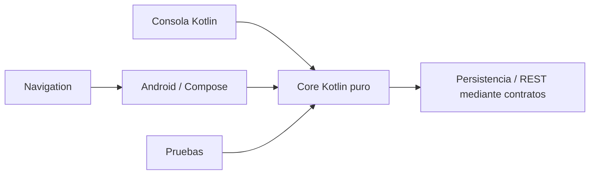

# DSY1105 · Desarrollo de Aplicaciones Móviles · 2026-2

Repositorio de apoyo para la asignatura **DSY1105 Desarrollo de Aplicaciones Móviles**, sección **009V**.

## Acceso rápido

- [`semanas/`](semanas/) — índice y contenido consolidado de cada semana.
- [`proyecto-formativo/`](proyecto-formativo/) — **PocketLog**, proyecto formativo transversal.
- [`docs/`](docs/) — conocimientos y guías transversales.
- [`labs/`](labs/) — laboratorios prácticos.
- [`examples/`](examples/) — ejemplos de código desarrollados en clases.
- [**Sitio web de la asignatura**](https://cmartinezs.github.io/DSY1105-DESARROLLO-APLICACIONES-MOVILES-2026-2/) — portal publicado desde `gh-pages`.
- [**Estándar de repositorio del estudiante**](docs/ESTANDAR-REPOSITORIO-ESTUDIANTE.md) — estructura, packages, Markdown y entregas Kotlin/Android.
- [**Acompañamiento del proyecto VcM**](docs/ACOMPANAMIENTO-PROYECTO-VCM.md) — frontera docente, alcance, trazabilidad y transferencia autónoma.
- [**Uso de GenAI y defensa de decisiones**](docs/USO-GENAI-Y-DEFENSA.md) — criterio de uso responsable y foco evaluativo.
- [**Capacidades nativas mediante miniapps**](docs/CAPACIDADES-NATIVAS-MINIAPPS.md) — estrategia monofoco para GPS, cámara, QR, sensores y posterior integración.
- [**Material público del curso**](https://drive.google.com/drive/folders/1_Ew_IE0InqJbPY0Ggu8p0cHl4Avv3rYs?usp=sharing) — biblioteca de archivos originales organizada semana a semana.

## Proyecto formativo transversal

Durante el semestre se utiliza **PocketLog** como hilo conductor formativo. La lógica creada inicialmente con Kotlin de consola evoluciona hacia Android sin perder la separación entre dominio e interfaz.

```mermaid
flowchart LR
    CONSOLE[Consola Kotlin] --> CORE[Core Kotlin puro]
    ANDROID[Android / Compose] --> CORE
    NAV[Navigation] --> ANDROID
    TESTS[Pruebas] --> CORE
    CORE --> DATA[Persistencia / REST mediante contratos]
```

PocketLog se pausa en semanas de evaluación sumativa y retoma su evolución cuando el contenido curricular lo justifica.

→ [Ver proyecto PocketLog](proyecto-formativo/)
→ [Ver diseño longitudinal](docs/PROYECTO-FORMATIVO-TRANSVERSAL.md)

## Organización del material

`master` mantiene las fuentes canónicas docentes. El contenido semanal vive en `semanas/semana-XX/`; los laboratorios en `labs/`; los ejemplos ejecutables en `examples/`; y la evolución longitudinal de PocketLog en `proyecto-formativo/`.

La rama `gh-pages` contiene únicamente la publicación web derivada/orientativa del curso. No debe existir una segunda copia canónica del sitio dentro de `master`.

Los archivos institucionales permanecen como fuente de referencia en la biblioteca pública de Google Drive. AVA continúa siendo la plataforma oficial para comunicaciones, actividades y recursos institucionales que deban gestionarse desde el entorno académico.

## Repositorio personal del estudiante

Cada estudiante mantiene un único repositorio `DSY1105-009V-nombre-apellido`, usa `cl.duoc.<usuario-duoc-sin-puntos>` como raíz de package y documenta su repo y entregas mediante `README.md`.

→ [Ver estándar completo](docs/ESTANDAR-REPOSITORIO-ESTUDIANTE.md)

## Semana actual

**Semana 13 · 2 al 7 de noviembre de 2026**

Inicio de EA3: **HTTP/JSON, consumo REST mediante Retrofit y presentación en Compose con MVVM**. Continuidad del proyecto VcM, correcciones de EP2 y preparación del video Hito 2.

→ [Ruta completa de Semana 13](semanas/semana-13/README.md)
→ [Laboratorio guiado LecturasRemotas](labs/semana-13-lecturas-remotas/README.md)
→ [Requisitos del video Hito 2](semanas/semana-13/03-hito-2-vcm.md)
→ [Material público de Semana 13](https://drive.google.com/drive/folders/13-mGFaKMLyDonrS1et5FfMMY0rSMexlS)

**Importante:** AVA y las instrucciones oficiales prevalecen. Fecha límite y enlace de entrega del video pendientes de comunicación institucional. Esta actualización no acredita clases ya realizadas ni crea una nueva evaluación.
