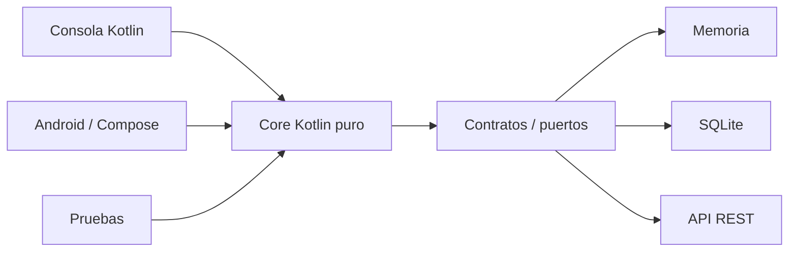
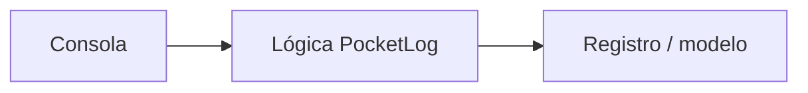
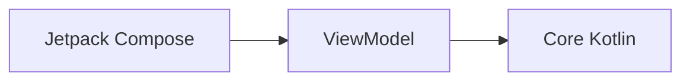
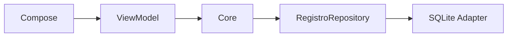
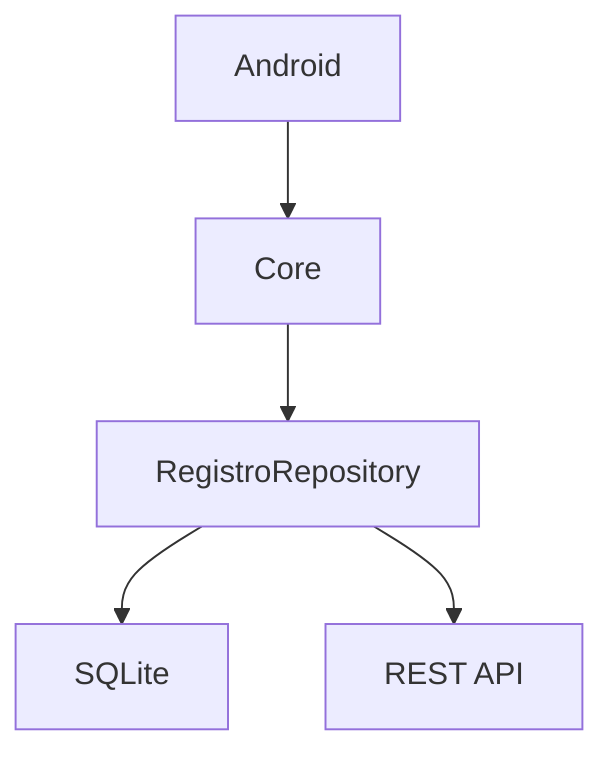
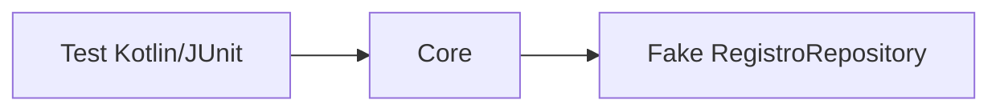
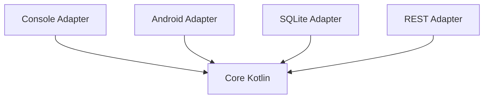

# Proyecto formativo transversal · PocketLog

## Propósito

**PocketLog** es el proyecto formativo transversal de DSY1105. Su objetivo es que el código escrito durante la Unidad 1 no se descarte al comenzar Android, sino que evolucione durante todo el semestre.

La regla arquitectónica central es:

> **La lógica del negocio debe poder ejecutarse sin saber si quien la utiliza es una consola, una pantalla Android, una base de datos SQLite o una API REST.**

Por eso el proyecto se divide conceptualmente en:



El **core** no debe importar `android.*`, Compose, SQLite, Retrofit ni clases de interfaz gráfica.

---

## Dominio

PocketLog es una bitácora personal de registros. Cada registro puede representar una idea, observación, pendiente o hallazgo.

Modelo objetivo inicial:

```text
Registro
- id
- titulo
- descripcion
- categoria
- estado
- tags
```

Durante la unidad móvil puede evolucionar con:

```text
- fotografía asociada
- fecha/hora
- ubicación u otro recurso nativo si corresponde
- persistencia local
- sincronización remota
```

El dominio es intencionalmente sencillo: el objetivo del curso no es aprender la industria de las bitácoras, sino Kotlin y desarrollo móvil.

---

# Metodología longitudinal

PocketLog **no es un enunciado de laboratorio que se entrega una vez**. Se desarrolla como una guía paso a paso durante el semestre.

Cada semana sigue esta secuencia:

```text
checkpoint anterior
        ↓
problema o limitación observable
        ↓
alternativas posibles
        ↓
decisión explicada
        ↓
implementación paso a paso
        ↓
descubrimiento autónomo acotado
        ↓
prueba / evidencia / defensa
        ↓
nuevo checkpoint versionado
```

## Qué debe contener cada guía semanal

Como mínimo:

1. estado inicial del código;
2. problema que motiva el nuevo contenido;
3. comparación entre alternativas cuando sea útil;
4. decisión adoptada y sus trade-offs;
5. cambios de código progresivos;
6. preguntas de predicción o pequeñas tareas sin solución inmediata;
7. pruebas a ejecutar;
8. reflexión final;
9. código final de la semana.

El alumno puede recibir bastante acompañamiento. El objetivo no es “adivinar la arquitectura”, sino **comprender por qué el código cambia**.

## Qué no debe ser la guía

No debe convertirse en:

```text
copiar bloque 1
copiar bloque 2
copiar bloque 3
funciona
fin
```

En puntos seleccionados el estudiante debe:

- predecir qué ocurrirá;
- elegir entre dos opciones;
- completar una pequeña función;
- probar una variación;
- explicar una decisión;
- detectar la limitación que prepara la semana siguiente.

---

# Versionado semanal

Cada semana deja una **nueva versión completa y ejecutable**.

Los checkpoints anteriores no se sobrescriben.

Ejemplo:

```text
checkpoint-semana-02/   PocketLog v0.2
checkpoint-semana-03/   PocketLog v0.3
checkpoint-semana-04/   PocketLog v0.4
...
```

Esto permite comparar directamente la evolución del mismo sistema.

## Regla

Una versión nueva debe documentar:

```text
RECIBE
qué podía hacer la versión anterior

AGREGA
qué concepto/capacidad incorpora esta semana

CAMBIA
qué código fue refactorizado y por qué

CONSERVA
qué comportamiento no debería romperse

DEJA ABIERTO
qué limitación preparará el siguiente incremento
```

---

# Evaluaciones

Las evaluaciones parciales **no reutilizan PocketLog como plantilla de solución**.

El proyecto formativo se pausa durante EP1, EP2 y EP3, y se retoma desde el último checkpoint estable al terminar la evaluación.

Esto separa claramente:

```text
aprendizaje acompañado → PocketLog

evidencia sumativa → dominio propio de la evaluación
```

---

# Unidad 1 · Kotlin independiente de Android

## Semana 2 · Fundamentos Kotlin · PocketLog v0.2

PocketLog comienza en consola.

Se trabajan:

- `val` / `var`;
- tipos;
- condicionales;
- ciclos;
- funciones;
- colecciones;
- `map` / `filter` / operaciones equivalentes.

### Decisión pedagógica

**No se utiliza `data class Registro` todavía.**

La versión v0.2 mantiene datos en colecciones paralelas:

```text
titulos
categorias
completados
```

Es una solución válida con el conocimiento disponible, pero incómoda y frágil.

Esa fragilidad es intencional porque deja preparada la pregunta:

> ¿Cómo representamos como una sola unidad todos los datos que pertenecen al mismo registro?

Eso crea la necesidad de POO en Semana 03.

Material:

- [`proyecto-formativo/semana-02/GUIA-PASO-A-PASO.md`](../proyecto-formativo/semana-02/GUIA-PASO-A-PASO.md)
- [`proyecto-formativo/checkpoint-semana-02/PocketLog.kt`](../proyecto-formativo/checkpoint-semana-02/PocketLog.kt)

## Semana 3 · POO, errores, corrutinas y Kotlin avanzado · PocketLog v0.3

Se parte **copiando/reutilizando v0.2**, no desde un proyecto vacío.

Problema de entrada:

```text
los datos de un Registro están repartidos entre listas paralelas
```

Se compararán alternativas, por ejemplo:

```text
seguir agregando listas
usar Map<String, Any>
representar el concepto con una clase/data class
```

Aparecen gradualmente:

- `data class Registro`;
- enum/clases de estado cuando aporte valor;
- encapsulación;
- manejo de errores;
- servicios o funciones asociadas al dominio;
- corrutinas cuando corresponda al contenido real.

Las abstracciones de persistencia se introducen solo cuando exista una necesidad didáctica clara; no se fuerza Repository demasiado temprano.

Checkpoint esperado:



## Semana 4 · Kotlin + Android Studio · PocketLog v0.4

Se reutiliza la lógica de v0.3.

El nuevo problema es:

> Tenemos lógica funcional en consola. ¿Debemos reescribirla para verla desde Android?

La respuesta que buscamos demostrar es **no**.

Se crea el primer consumidor Android manteniendo la mayor cantidad posible de Kotlin puro reutilizable.

La consola queda como evidencia histórica de que el dominio puede vivir sin Android.

## Semana 5 · Evaluación 1

PocketLog se pausa.

---

# Unidad 2 · Aplicación Android

## Semana 6 · Arquitectura, MVVM y Compose

PocketLog obtiene una interfaz Android más estructurada.



Si para ese momento ya existe una necesidad clara de acceso a datos desacoplado, se introduce el contrato correspondiente.

El ViewModel adapta el core a estado de pantalla; no absorbe reglas de negocio.

## Semana 7 · Diseño y navegación

Se agregan pantallas como:

- lista de registros;
- detalle;
- creación/edición.

La navegación cambia, el core permanece.

## Semana 8 · Formularios y validaciones

Las validaciones se separan en dos niveles:

- validación de presentación: campos requeridos/formato;
- reglas de negocio reutilizables: permanecen en el core.

## Semana 9 · Estado, persistencia y recursos nativos

Se agrega fotografía u otro recurso nativo al registro.

La captura de cámara pertenece al adapter Android. El core recibe una referencia/identificador neutral, no un `Bitmap` ni una clase Android.

Ejemplo:

```text
Core: fotoUri: String?
Android: convierte resultado de cámara → URI/string
```

## Semana 10 · SQLite

Aquí la necesidad de una abstracción de persistencia se vuelve explícita.



Si existía una implementación temporal en memoria, se compara con SQLite y se demuestra qué código cambia y qué código se conserva.

## Semanas 11–12 · Evaluación 2

PocketLog se pausa.

---

# Unidad 3 · Integración, calidad y distribución

## Semana 13 · REST

Se incorpora un adapter remoto.



Se compara explícitamente:

```text
persistencia local
vs
fuente remota
```

El dominio no conoce Retrofit, JSON ni HTTP.

## Semana 14 · Pruebas

El desacoplamiento permite probar el core sin emulador:



La guía debe comparar al menos:

```text
probar con dependencia real
vs
probar con fake/controlado
```

## Semana 15 · APK firmado

PocketLog se empaqueta como una aplicación completa. No debería requerir cambios de negocio para generar el APK.

## Semanas 16–17 · Evaluación 3

PocketLog vuelve a pausarse.

---

# Regla de dependencias objetivo

A medida que el curso avance, la dirección conceptual debe tender hacia el core:



Nunca:

```text
core → Android
core → Compose
core → SQLite
core → Retrofit
```

---

# Qué significa “agnóstico a quien use el core”

Una operación como:

```text
crearRegistro(...)
filtrarPorCategoria(...)
marcarComoCompletado(...)
```

no debería saber si fue invocada desde:

- `main()`;
- un botón Compose;
- un ViewModel;
- una prueba automática;
- una futura API o interfaz diferente.

Eso permite reutilizar realmente el trabajo de las primeras semanas.

---

# Criterio pedagógico final

No se enseñará toda la arquitectura desde Semana 2 como teoría anticipada.

La arquitectura existe como **dirección docente**, pero cada abstracción se introduce cuando el estudiante ya siente el problema que resuelve.

La secuencia deseada es:

```text
hacer funcionar
        ↓
observar limitación
        ↓
comparar opciones
        ↓
aprender concepto nuevo
        ↓
refactorizar PocketLog
        ↓
comprobar que lo anterior sigue funcionando
```

Así cada semana cuenta una parte de la historia del mismo software y el estudiante puede ver cómo una solución evoluciona con el conocimiento adquirido.
