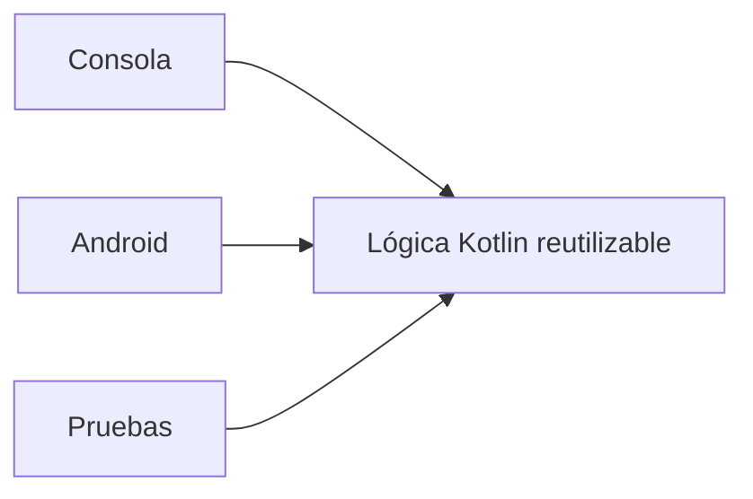

# Proyecto formativo transversal · PocketLog

## Propósito

**PocketLog** es el proyecto formativo transversal de DSY1105. Su objetivo es que el código construido durante Kotlin de consola evolucione hacia una aplicación móvil completa **siguiendo el avance real de la asignatura**.

La regla principal no es arquitectónica, sino curricular:

> **PocketLog solo incorpora durante una semana conceptos, técnicas y tecnologías que correspondan al contenido planificado para esa semana o que ya hayan sido estudiados anteriormente.**

La arquitectura desacoplada sigue siendo una dirección docente, pero no se adelanta como contenido para el estudiante.

---

# Fuente de verdad para cada incremento

Antes de preparar una nueva versión de PocketLog se revisa, en este orden:

1. cronograma institucional de DSY1105;
2. coordinación/material institucional de la semana;
3. avance real de la sección;
4. checkpoint PocketLog de la semana anterior.

Solo entonces se define el incremento.

```text
contenido planificado
        +
avance real
        +
checkpoint anterior
        ↓
problema didáctico de la semana
        ↓
PocketLog versión nueva
```

Si una técnica sería arquitectónicamente conveniente pero aún **no corresponde curricularmente**, se deja pendiente.

---

# Metodología longitudinal

PocketLog se desarrolla como una guía paso a paso.

Cada semana sigue esta secuencia:

```text
checkpoint anterior
        ↓
problema observable relacionado con el contenido semanal
        ↓
alternativas posibles con conocimientos disponibles
        ↓
decisión explicada
        ↓
implementación paso a paso
        ↓
descubrimiento autónomo acotado
        ↓
prueba / evidencia / explicación
        ↓
nuevo checkpoint ejecutable
```

Cada guía semanal debe contener:

1. **RECIBE** · qué hace la versión anterior;
2. **APRENDEMOS** · contenidos de la semana que se usarán;
3. **PROBLEMA** · qué limitación de PocketLog permite introducirlos;
4. **ALTERNATIVAS** · soluciones posibles con comparación simple;
5. **DECISIÓN** · qué alternativa se utilizará y por qué;
6. **PASO A PASO** · modificación progresiva del código;
7. **DESCUBRE TÚ** · pequeñas partes que el alumno debe resolver;
8. **COMPRUEBA** · pruebas manuales o automatizadas según lo ya aprendido;
9. **CHECKPOINT** · versión completa y ejecutable;
10. **DEJA ABIERTO** · limitación que puede preparar un contenido futuro, sin enseñarlo antes de tiempo.

---

# Versionado

Cada semana de trabajo formativo deja una versión completa y preserva las anteriores.

```text
checkpoint-semana-02/   PocketLog v0.2
checkpoint-semana-03/   PocketLog v0.3
checkpoint-semana-04/   PocketLog v0.4
...
```

Las semanas de evaluación no generan artificialmente una nueva versión solo para mantener el número correlativo.

---

# Dominio

PocketLog es una bitácora personal de registros. El dominio se mantiene sencillo para que el protagonismo sea de Kotlin y desarrollo móvil.

Los datos y capacidades también **crecen con el plan**. No se agregan por adelantado atributos para una tecnología futura.

Ejemplo conceptual de evolución:

```text
Semana 02
registros representados con estructuras básicas

Semana 03
Registro como objeto/clase

Semanas Android
los mismos registros visibles y editables desde interfaz móvil

Semana de recursos nativos
fotografía solo cuando el contenido introduce cámara

Semana SQLite
persistencia SQLite solo cuando corresponde

Semana REST
fuente remota solo cuando corresponde
```

---

# Matriz de trazabilidad · cronograma → PocketLog

Esta tabla es la **fuente de verdad del roadmap formativo**. La implementación concreta puede ajustarse al avance real de la sección, pero no debe adelantarse respecto del contenido.

| Semana | Contenido planificado | Incremento permitido en PocketLog | Lo que NO se adelanta |
|---|---|---|---|
| 1 | Panorama del desarrollo de aplicaciones | Contexto del proyecto; eventualmente comparar tecnologías/lenguajes. No es necesario crear checkpoint funcional. | Kotlin avanzado, POO, Android. |
| 2 | Programación de Kotlin y fundamentos; Kotlin básico; colecciones y funciones | **v0.2 consola:** variables, tipos, operadores, condicionales, ciclos, funciones, `List`/`MutableList`, iteración, `map`/`filter` cuando hayan sido vistos. | `data class`, POO, corrutinas, Android, MVVM, persistencia. |
| 3 | POO y control de errores; corrutinas y sintaxis avanzada Kotlin | **v0.3 consola:** refactor de las estructuras de v0.2 hacia clases/data classes; responsabilidades simples; manejo de errores; corrutinas y sintaxis avanzada solo en los puntos cubiertos por la guía/clase. | Compose, ViewModel, navegación, SQLite, REST. |
| 4 | Kotlin y Android Studio; primer aplicativo en Android Studio | **v0.4:** crear el primer consumidor Android reutilizando la lógica Kotlin que sea viable; comprender estructura básica del proyecto Android y ejecutar la app. | MVVM/arquitectura de Unidad 2, navegación compleja, persistencia. |
| 5 | Evaluación Parcial 1 | **PocketLog se pausa.** | No usar PocketLog como plantilla de la evaluación. |
| 6 | Arquitectura y planificación colaborativa; configuración inicial con MVVM; componentes básicos de diseño; pantalla base con Jetpack Compose | Retomar PocketLog y estructurar el proyecto móvil según lo enseñado; incorporar MVVM y pantalla base Compose. | Navegación avanzada, formularios de Semana 8, SQLite. |
| 7 | Diseño visual profesional/adaptable; navegación y estructura visual | Mejorar jerarquía/adaptabilidad visual; incorporar flujo de navegación entre las pantallas necesarias de PocketLog. | Formularios/validaciones no vistos, persistencia. |
| 8 | Formularios, validaciones y componentes interactivos; paso de información | Incorporar creación/edición mediante formularios; validaciones y paso de datos entre pantallas según lo aprendido. | Cámara, SQLite, REST. |
| 9 | Estado, persistencia y animaciones; recursos nativos; cámara | Incorporar gestión de estado y persistencia del tipo enseñado esa semana, animaciones si aportan al caso y **cámara** como recurso nativo de PocketLog. | SQLite avanzado si aún no corresponde; REST. |
| 10 | Persistencia avanzada con SQLite | Sustituir/complementar la persistencia anterior con SQLite según la guía institucional. Refactorizar solo lo necesario para integrar la base local. | REST, testing de Semana 14. |
| 11 | Evaluación Parcial 2 | **PocketLog se pausa.** | No usarlo como solución de la evaluación. |
| 12 | Evaluación Parcial 2 | **PocketLog continúa pausado.** | No agregar contenido nuevo fuera del plan. |
| 13 | Consumo de servicios REST y conexión interfaz-backend | Incorporar consumo de API REST y conectar datos remotos con la interfaz de PocketLog. Las decisiones local/remoto se enseñan solo al nivel requerido por la semana. | Testing formal aún no visto, firma APK. |
| 14 | Pruebas unitarias y aseguramiento de calidad | Incorporar pruebas unitarias sobre lógica que sea testeable y revisar/refactorizar defectos detectados. | Firma/distribución si aún no corresponde. |
| 15 | Compilación segura y firma de aplicación móvil | Preparar la versión formativa completa, generar APK y realizar firma/configuración según lo enseñado. | Nuevas capacidades funcionales no justificadas. |
| 16 | Evaluación Parcial 3 | **PocketLog se pausa.** | No usarlo como plantilla de evaluación. |
| 17 | Evaluación Parcial 3 | **PocketLog continúa pausado.** | No agregar incremento artificial. |
| 18 | EFT | PocketLog puede quedar como evidencia histórica del proceso formativo; no sustituye la EFT. | — |

---

# Unidad 1 · Cómo crece el core sin adelantar contenido

## Semana 02 · PocketLog v0.2

Contenido habilitado:

```text
val / var
tipos
operadores
if / when
for / while
funciones
colecciones
map / filter cuando corresponda
```

La representación puede ser procedural e incómoda. Eso es correcto para el conocimiento disponible.

Por ejemplo:

```text
titulos
categorias
completados
```

No utilizamos `data class Registro` antes de POO.

La limitación queda visible, pero **la solución se enseña recién en Semana 03**.

Material:

- [`proyecto-formativo/semana-02/GUIA-PASO-A-PASO.md`](../proyecto-formativo/semana-02/GUIA-PASO-A-PASO.md)
- [`proyecto-formativo/checkpoint-semana-02/PocketLog.kt`](../proyecto-formativo/checkpoint-semana-02/PocketLog.kt)

## Semana 03 · PocketLog v0.3

La necesidad de agrupar los datos de un registro permite introducir POO.

Ahora sí se puede comparar:

```text
listas paralelas
vs
Map
vs
clase/data class
```

y refactorizar usando los contenidos oficiales de POO y manejo de errores.

Las corrutinas se incorporarán a una operación concreta **solo después de trabajarlas en la semana**; no se añaden como decoración arquitectónica.

## Semana 04 · PocketLog v0.4

La pregunta pasa a ser:

> Ya tenemos lógica Kotlin funcionando. ¿Cómo la ejecutamos desde una aplicación Android?

El incremento se limita a lo que contempla la introducción práctica a Android Studio y Kotlin y la guía del primer aplicativo.

No se fuerza MVVM antes de Semana 06.

---

# Unidad 2 · Android según el orden curricular

La arquitectura móvil tampoco se instala completa el primer día.

```text
Semana 04 → primer aplicativo Android
Semana 06 → arquitectura/MVVM + Compose base
Semana 07 → diseño + navegación
Semana 08 → formularios + validación + paso de datos
Semana 09 → estado + animación + recursos nativos/cámara
Semana 10 → SQLite
```

Cada paso reutiliza el anterior.

Así, por ejemplo, la pantalla de creación no se construye completa en Semana 06 si formularios y validación corresponden a Semana 08.

---

# Unidad 3 · Integración según el orden curricular

```text
Semana 13 → REST
Semana 14 → pruebas unitarias
Semana 15 → compilación segura y firma
```

REST no se incorpora antes para “preparar arquitectura”.

Las pruebas unitarias pueden naturalmente apoyarse en el desacoplamiento logrado, pero **el contenido formal de testing aparece cuando el plan lo indica**.

---

# Dirección arquitectónica docente

Existe una intención de mantener la lógica reutilizable y evitar acoplarla innecesariamente a Android:



Más adelante, cuando persistencia y REST aparezcan curricularmente, podrán surgir contratos o separaciones adicionales.

Pero esta arquitectura es una **dirección de diseño**, no una lista de patrones que el alumno deba implementar antes de estudiarlos.

Regla:

> Primero aparece el problema y el contenido de la semana; después PocketLog adopta la abstracción que ayuda a resolverlo.

---

# Regla para preparar cada semana futura

Antes de crear `checkpoint-semana-XX` debemos responder:

```text
1. ¿Qué dice exactamente el cronograma esta semana?
2. ¿Qué alcanzó realmente a ver la sección anterior?
3. ¿Qué puede hacer hoy PocketLog?
4. ¿Qué problema de PocketLog crea una necesidad natural del contenido nuevo?
5. ¿Cuál es el cambio mínimo que demuestra ese aprendizaje?
6. ¿Qué concepto debemos evitar porque corresponde a una semana posterior?
7. ¿Qué versión completa y ejecutable quedará como checkpoint?
```

Si no podemos justificar una modificación por alguno de los contenidos estudiados, **no se incorpora todavía**.
