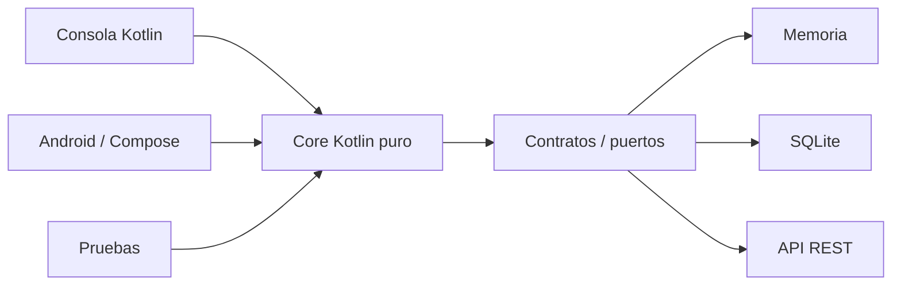
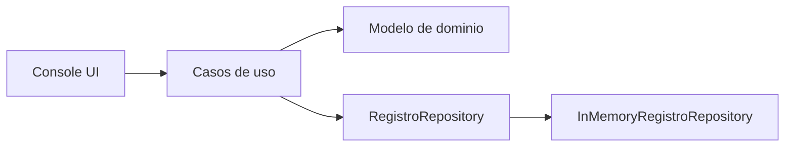
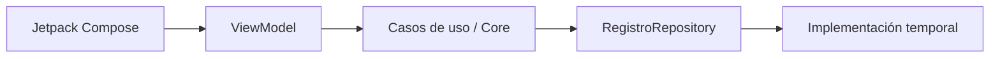
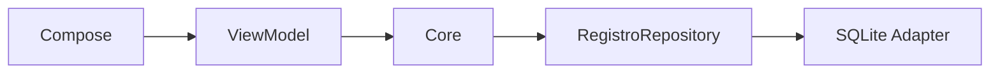
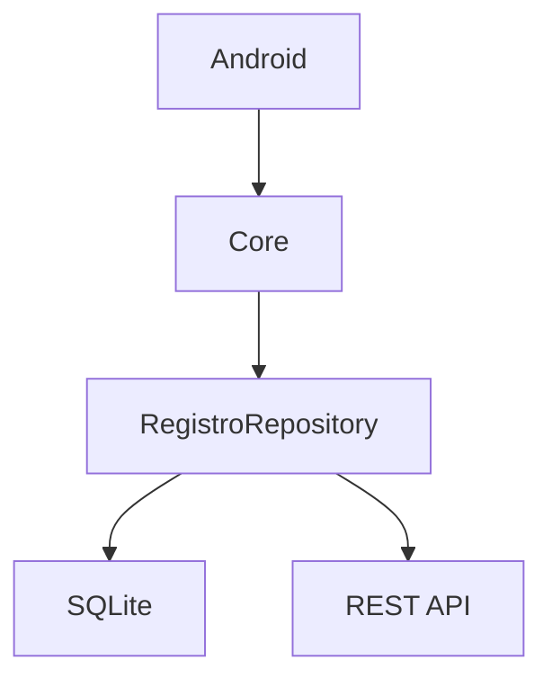
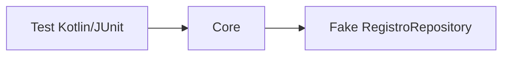
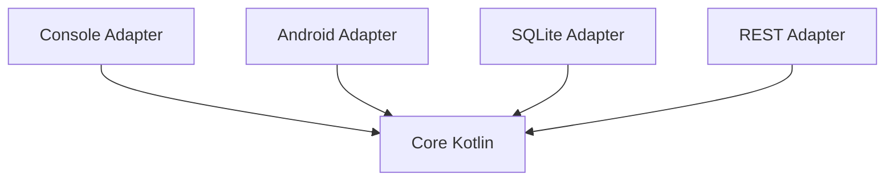

# Proyecto formativo transversal · PocketLog

## Propósito

**PocketLog** es el proyecto formativo transversal de DSY1105. Su objetivo es que el código escrito durante la Unidad 1 no se descarte al comenzar Android, sino que evolucione durante todo el semestre.

La regla arquitectónica central es:

> **La lógica del negocio debe poder ejecutarse sin saber si quien la utiliza es una consola, una pantalla Android, una base de datos SQLite o una API REST.**

Por eso el proyecto se divide conceptualmente en:



El **core** no debe importar `android.*`, Compose, SQLite, Retrofit ni clases de interfaz gráfica.

---

## Dominio

PocketLog es una bitácora personal de registros. Cada registro puede representar una idea, observación, pendiente o hallazgo.

Modelo inicial:

```text
Registro
- id
- titulo
- descripcion
- categoria
- estado
- tags
```

Durante la unidad móvil puede evolucionar con:

```text
- fotografía asociada
- fecha/hora
- ubicación u otro recurso nativo si corresponde
- persistencia local
- sincronización remota
```

El dominio es intencionalmente sencillo: el objetivo del curso no es aprender la industria de las bitácoras, sino Kotlin y desarrollo móvil.

---

# Principio de continuidad

Cada semana recibe un checkpoint anterior, incorpora una capacidad nueva y deja un checkpoint reutilizable.

```text
checkpoint anterior
        ↓
contenido nuevo
        ↓
modificación de PocketLog
        ↓
evidencia + explicación
        ↓
nuevo checkpoint
```

Las evaluaciones parciales **no reutilizan PocketLog como plantilla de solución**. El proyecto formativo se pausa durante la evaluación y continúa después.

---

# Unidad 1 · Kotlin independiente de Android

## Semana 2 · Fundamentos Kotlin

PocketLog comienza en consola.

Se trabajan:

- `val` / `var`;
- tipos;
- condicionales;
- ciclos;
- funciones;
- colecciones;
- `map` / `filter`.

Checkpoint sugerido:

```text
lista de registros
+ crear registros en memoria
+ listar
+ filtrar por categoría/estado
+ transformar datos para mostrar resúmenes
```

Todavía puede ser procedural. No se exige arquitectura avanzada antes de haber aprendido POO.

## Semana 3 · POO, errores, corrutinas y Kotlin avanzado

El código de Semana 2 se refactoriza.

Aparecen gradualmente:

- `data class Registro`;
- enum/clases de estado;
- encapsulación;
- `RegistroRepository` como contrato;
- implementación `InMemoryRegistroRepository`;
- servicios/casos de uso simples;
- manejo de errores;
- corrutinas cuando corresponda.

Checkpoint:



## Semana 4 · Kotlin + Android Studio

La primera app Android **no reescribe la lógica**.

Se crea un adapter Android que consume el mismo core.

La consola queda como evidencia de que el core no depende de Android.

## Semana 5 · Evaluación 1

PocketLog se pausa. La evaluación utiliza su propio problema y criterios.

---

# Unidad 2 · Aplicación Android

## Semana 6 · Arquitectura, MVVM y Compose

PocketLog obtiene una interfaz Android.



El ViewModel adapta el core a estado de pantalla; no absorbe reglas de negocio.

## Semana 7 · Diseño y navegación

Se agregan pantallas como:

- lista de registros;
- detalle;
- creación/edición.

La navegación cambia, el core permanece.

## Semana 8 · Formularios y validaciones

Las validaciones se separan en dos niveles:

- validación de presentación: campos requeridos/formato;
- reglas de negocio reutilizables: permanecen en el core.

## Semana 9 · Estado, persistencia y recursos nativos

Se agrega fotografía u otro recurso nativo al registro.

La captura de cámara pertenece al adapter Android. El core recibe una referencia/identificador neutral, no un `Bitmap` ni una clase Android.

Ejemplo:

```text
Core: fotoUri: String?
Android: convierte resultado de cámara → URI/string
```

## Semana 10 · SQLite

Se reemplaza la implementación en memoria:



El código que usa `RegistroRepository` no cambia por utilizar SQLite.

## Semanas 11–12 · Evaluación 2

PocketLog se pausa mientras se desarrolla la evaluación.

---

# Unidad 3 · Integración, calidad y distribución

## Semana 13 · REST

Se incorpora un adapter remoto.



Dependiendo del contenido real de la semana se puede trabajar:

- repositorio remoto;
- datasource local/remoto;
- sincronización;
- estrategia offline-first simplificada.

El dominio no conoce Retrofit, JSON ni HTTP.

## Semana 14 · Pruebas

El desacoplamiento permite probar el core sin emulador:



También se prueban adaptadores o ViewModels cuando corresponda.

## Semana 15 · APK firmado

PocketLog se empaqueta como una aplicación completa. No debería requerir cambios en el core para generar el APK.

## Semanas 16–17 · Evaluación 3

PocketLog vuelve a pausarse durante la evaluación.

---

# Regla de dependencias

La dirección conceptual siempre debe ser hacia el core:



Nunca:

```text
core → Android
core → Compose
core → SQLite
core → Retrofit
```

---

# Qué significa “agnóstico a quien use el core”

Una operación como:

```text
crearRegistro(...)
filtrarPorCategoria(...)
marcarComoCompletado(...)
```

no debería saber si fue invocada desde:

- `main()`;
- un botón Compose;
- un ViewModel;
- una prueba automática;
- una futura API o interfaz diferente.

Eso permite reutilizar realmente el trabajo de las primeras semanas.

---

# Criterio pedagógico

No se enseñará toda la arquitectura desde Semana 2 como teoría anticipada.

La arquitectura existe como **dirección docente**, pero cada abstracción se introduce cuando el estudiante ya siente el problema que resuelve:

1. primero código funcional;
2. luego aparece duplicación/estado;
3. se introduce POO;
4. aparece más de una interfaz de entrada;
5. se separa el core;
6. aparece persistencia;
7. se introduce el contrato de repositorio;
8. aparecen SQLite/REST como implementaciones intercambiables.

Así cada concepto responde a una necesidad observable y no a una regla arquitectónica memorizada.
