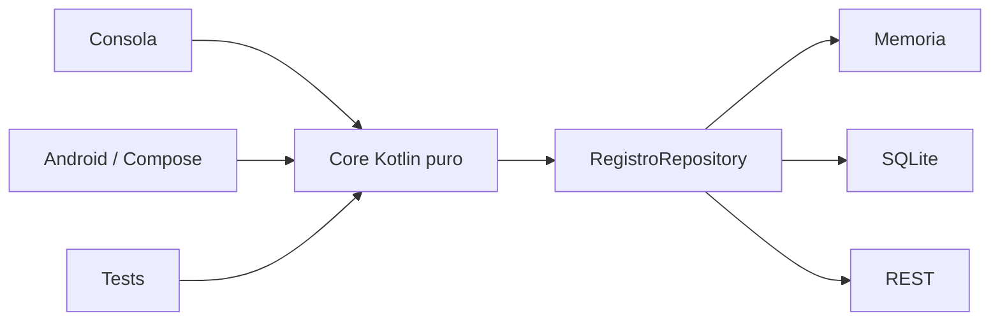

# PocketLog · Proyecto formativo transversal

PocketLog es el proyecto formativo longitudinal de **DSY1105 Desarrollo de Aplicaciones Móviles**.

Su objetivo es que la lógica construida durante Kotlin de consola evolucione hacia Android, persistencia, REST y pruebas **sin reescribir el dominio desde cero**.

## Cómo se trabaja PocketLog

PocketLog se desarrolla como una **guía paso a paso longitudinal**.

Cada semana debe contener:

1. **checkpoint de entrada**: la versión terminada la semana anterior;
2. **problema nuevo**: una limitación o necesidad observable;
3. **alternativas**: al menos dos formas razonables de resolverla cuando tenga sentido;
4. **decisión**: se explica qué opción se utilizará y por qué;
5. **implementación paso a paso**;
6. **pequeños espacios de descubrimiento autónomo**;
7. **pruebas/evidencia**;
8. **checkpoint de salida**: una nueva versión ejecutable del código.

La guía no debe convertirse en “copiar y pegar hasta que funcione”. Cada decisión importante debe poder ser explicada por el estudiante.

## Política de versiones

Los checkpoints **no se sobrescriben**.

```text
PocketLog v0.2 · Semana 02 · fundamentos Kotlin
        ↓
PocketLog v0.3 · Semana 03 · POO / errores / Kotlin avanzado
        ↓
PocketLog v0.4 · Semana 04 · primer consumidor Android
        ↓
EP1 · pausa del proyecto formativo
        ↓
PocketLog v0.6 · Semana 06 · Compose / MVVM
        ↓
...
```

Cada semana conserva su código final como evidencia histórica. Esto permite comparar cómo evoluciona una solución cuando aparecen nuevos requisitos y nuevos conocimientos.

> La numeración sigue la semana (`v0.2`, `v0.3`, etc.) durante la fase formativa inicial. Podemos cambiar a una versión `1.0` cuando exista una app móvil funcional consolidada.

## Arquitectura objetivo



La arquitectura se construirá **gradualmente**. No se espera que un estudiante de Semana 2 implemente todas estas piezas.

## Estructura actual

```text
proyecto-formativo/
├── README.md
├── semana-02/
│   └── GUIA-PASO-A-PASO.md
└── checkpoint-semana-02/
    └── PocketLog.kt
```

En semanas posteriores se incorporarán:

```text
semana-03/GUIA-PASO-A-PASO.md
checkpoint-semana-03/...
semana-04/GUIA-PASO-A-PASO.md
checkpoint-semana-04/...
```

## Regla de continuidad

Cada checkpoint debe poder responder:

1. ¿qué recibimos de la semana anterior?;
2. ¿qué problema nuevo apareció?;
3. ¿qué alternativas consideramos?;
4. ¿qué decisión tomamos y por qué?;
5. ¿qué concepto nuevo incorporamos?;
6. ¿qué cambió en PocketLog?;
7. ¿qué evidencia deja el estudiante?;
8. ¿qué limitación queda preparada para la semana siguiente?

## Regla pedagógica

Una abstracción nueva debe aparecer preferentemente porque **resuelve una incomodidad visible de la versión anterior**.

Ejemplo:

```text
Semana 02
3 listas paralelas
        ↓
problema: mantener los datos sincronizados es frágil
        ↓
Semana 03
Registro como una sola unidad
        ↓
POO tiene una razón concreta de existir
```

No adelantaremos arquitectura solo porque sabemos que será necesaria después.

## Evaluaciones

PocketLog es **formativo**.

Durante EP1, EP2 y EP3 se pausa. No se usa como solución, plantilla ni dominio equivalente de la evaluación sumativa.

Después de cada evaluación se retoma desde el último checkpoint formativo estable.

## Documento de diseño docente

Ver [Proyecto formativo transversal · PocketLog](../docs/PROYECTO-FORMATIVO-TRANSVERSAL.md).
