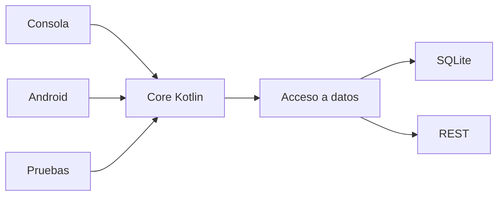

# PocketLog · Proyecto formativo transversal

PocketLog es el proyecto formativo longitudinal de **DSY1105 Desarrollo de Aplicaciones Móviles**.

Su objetivo es que el código construido durante Kotlin de consola evolucione hacia Android, persistencia, REST y pruebas **sin comenzar un proyecto distinto en cada unidad**.

## Cómo se trabaja PocketLog

PocketLog avanza siguiendo el ritmo real de la asignatura:

```text
semana
  ↓
clase real
  ↓
contenido visto en esa sesión
  ↓
incremento pequeño del mismo software
  ↓
estado funcional de salida
  ↓
la siguiente clase continúa desde ahí
```

No se prepara una versión idealizada de toda la semana para que el estudiante la copie. Cada sesión tiene su propia guía y parte desde el resultado de la sesión anterior.

## Roadmap docente del semestre

El plan completo de evolución está documentado en:

➡️ **[ROADMAP-SEMANAL.md](./ROADMAP-SEMANAL.md)**

Ese documento mantiene alineados:

- cronograma institucional;
- incremento PocketLog de cada semana;
- conceptos que todavía no deben adelantarse;
- checkpoints esperados;
- separación progresiva de responsabilidades;
- compatibilidad futura con **Mobile-Compose**.

> El roadmap orienta; el contenido institucional y el avance real de la sección siguen siendo la fuente de verdad.

## Alineación con Mobile-Compose

PocketLog debe llegar a la etapa Android sin obligarnos a desechar la lógica Kotlin construida antes.

La dirección objetivo es mantener separables:

```text
presentación Android / Compose
        ↓
lógica y dominio Kotlin reutilizable
        ↓
acceso a datos
        ↓
implementaciones locales/remotas
```

Los nombres concretos de paquetes, módulos y componentes **no se fijarán artificialmente antes de revisar Mobile-Compose**. Cuando ese proyecto esté disponible para inspección, su estructura se reconciliará con el roadmap y se adoptarán sus convenciones cuando corresponda.

## Estructura pedagógica de cada semana

Como referencia, una semana puede quedar así:

```text
semana-XX/
├── README.md                    # mapa de la semana
├── 00-punto-de-partida.md       # qué recibimos y qué NO sabemos todavía
├── 01-clase-01-....md           # sesión real 1
├── 02-clase-02-....md           # sesión real 2
├── 03-cierre-y-checkpoint.md    # síntesis y versión estable
└── EXPLORA.md                   # profundización opcional
```

La cantidad de archivos de clase depende del horario y del avance real. Una semana con una sola sesión no necesita inventar dos guías; una semana con más sesiones puede tener más pasos.

## Anatomía de una guía de clase

Cada guía debería hacer visible:

1. **punto de entrada**: qué código debe funcionar antes de comenzar;
2. **objetivo de la sesión**;
3. **contenido del plan que corresponde hoy**;
4. **ruta de la clase** con etapas pequeñas;
5. **primera solución explícita**, especialmente cuando el concepto es nuevo;
6. **comparación/refactor** hacia sintaxis o diseño más idiomático;
7. **decisiones y alternativas**;
8. **prueba autónoma breve**;
9. **checkpoint de salida de la clase**;
10. **pregunta o limitación abierta**, solo si prepara de forma natural lo que viene después.

La experiencia deseada es:

```text
PARTIMOS CON...
      ↓
HOY NECESITAMOS...
      ↓
LO HACEMOS DE LA FORMA MÁS EXPLÍCITA
      ↓
ENTENDEMOS EL MECANISMO
      ↓
COMPARAMOS OTRA FORMA
      ↓
APLICAMOS EN POCKETLOG
      ↓
PRUEBA TÚ
      ↓
HOY TERMINAMOS AQUÍ
```

## Regla principal: el plan manda

PocketLog **no define el contenido del curso**.

El cronograma y el avance real de la sección determinan qué puede incorporarse.

Antes de crear una nueva guía se revisa:

```text
¿Qué corresponde esta semana?
¿Qué se alcanzó realmente en la clase anterior?
¿Qué herramientas conoce el estudiante?
¿Qué incremento de PocketLog permite practicar exactamente eso?
¿Qué concepto futuro debemos evitar adelantar?
```

Si una modificación no puede justificarse por contenido ya visto o correspondiente a la sesión actual, se posterga.

## Sintaxis: primero entender, después acortar

Especialmente en Kotlin, PocketLog seguirá esta progresión:

```text
forma explícita
→ mecanismo visible
→ comparación con Java cuando aporte valor
→ forma Kotlin equivalente
→ forma idiomática más corta
→ decisión de legibilidad
```

Ejemplo:

```kotlin
var pendientes = 0
for (completado in completados) {
    if (!completado) {
        pendientes = pendientes + 1
    }
}
```

solo después puede evolucionar a:

```kotlin
val pendientes = completados.count { !it }
```

El objetivo no es escribir menos caracteres; es poder explicar qué abstracción reemplazó al mecanismo anterior.

## Exploración guiada opcional

Cada semana puede incorporar `EXPLORA.md`.

Debe ser cercana al contenido actual, breve y no necesaria para completar el checkpoint.

Puede:

- profundizar una función o construcción recién vista;
- comparar otra alternativa;
- hacer visible una limitación;
- investigar una herramienta vecina.

No debe enseñar anticipadamente la solución conceptual completa de una semana posterior.

## Política de checkpoints

Los estados semanales **no se sobrescriben**.

```text
checkpoint-semana-02/   PocketLog v0.2
checkpoint-semana-03/   PocketLog v0.3
checkpoint-semana-04/   PocketLog v0.4
...
```

Además, dentro de cada guía se deja claro cuál es el **estado de salida de cada clase**, aunque el checkpoint versionado formal se consolide al cierre semanal.

Esto permite distinguir:

```text
lo planificado para la semana
≠
lo que efectivamente alcanzamos hoy
```

Si una clase avanza menos de lo previsto, la siguiente guía se ajusta desde el estado real.

## Arquitectura objetivo docente

A largo plazo buscamos que la lógica reutilizable no dependa de quien la consume:



Pero esta imagen es **dirección docente**, no contenido que deba implementarse anticipadamente.

Las abstracciones aparecen solamente cuando el plan y una necesidad observable del código permiten enseñarlas con sentido.

## Evaluaciones

PocketLog es formativo.

Durante EP1, EP2 y EP3 se pausa. No se utiliza como plantilla de la evaluación ni se hace evolucionar mientras corresponde desarrollar evidencia sumativa.

Después se retoma desde el último checkpoint formativo estable.

## Semana actual

➡️ [PocketLog · Semana 02](./semana-02/README.md)

## Documento de diseño docente

Ver [Proyecto formativo transversal · PocketLog](../docs/PROYECTO-FORMATIVO-TRANSVERSAL.md).
