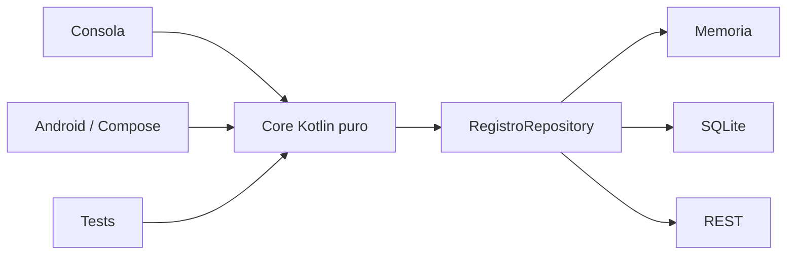

# PocketLog · Proyecto formativo transversal

PocketLog es el proyecto formativo longitudinal de **DSY1105 Desarrollo de Aplicaciones Móviles**.

Su objetivo es que la lógica construida durante Kotlin de consola evolucione hacia Android, persistencia, REST y pruebas **sin reescribir el dominio desde cero**.

## Arquitectura objetivo



La arquitectura se construirá **gradualmente**. No se espera que un estudiante de Semana 2 implemente todas estas piezas.

## Estructura

```text
proyecto-formativo/
├── README.md
└── checkpoint-semana-02/
    └── PocketLog.kt
```

En semanas posteriores se incorporarán nuevos checkpoints en vez de reemplazar el proyecto con ejercicios desconectados.

## Regla de continuidad

Cada checkpoint debe poder responder:

1. ¿qué recibimos de la semana anterior?;
2. ¿qué concepto nuevo incorporamos?;
3. ¿qué cambió en PocketLog?;
4. ¿qué evidencia deja el estudiante?;
5. ¿qué queda reutilizable para la semana siguiente?

## Documento de diseño docente

Ver [Proyecto formativo transversal · PocketLog](../docs/PROYECTO-FORMATIVO-TRANSVERSAL.md).
