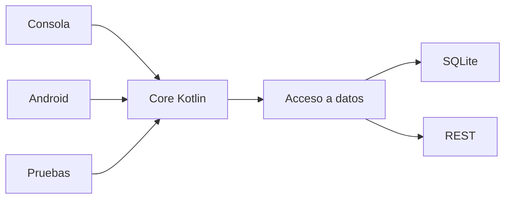

# PocketLog · Proyecto formativo transversal

PocketLog es el proyecto formativo longitudinal de **DSY1105 Desarrollo de Aplicaciones Móviles**.

Su objetivo es que el código construido durante Kotlin de consola evolucione hacia Android, persistencia, REST y pruebas **sin comenzar un proyecto distinto en cada unidad**.

## Estructura canónica

PocketLog separa explícitamente tres cosas distintas:

```text
proyecto-formativo/
├── README.md
├── ROADMAP-SEMANAL.md
├── pocketlog/                 # proyecto vivo: estado actual reutilizable
├── checkpoints/               # snapshots históricos estables
│   └── semana-02/
└── guias/                     # instrucciones y ruta pedagógica
    └── semana-02/
```

### `pocketlog/` · proyecto vivo

Es la versión desde la que se continúa trabajando. **No se crea un PocketLog nuevo por semana.**

→ [Abrir PocketLog vivo](./pocketlog/)

### `checkpoints/` · historia ejecutable

Conserva estados estables que permiten observar la evolución del proyecto sin convertirlos en ramas paralelas de desarrollo.

→ [Checkpoint Semana 2](./checkpoints/semana-02/)

### `guias/` · recorrido didáctico

Conserva las instrucciones clase a clase y por semana. Una guía explica cómo llegar al siguiente estado; no es el proyecto en sí.

→ [Guías Semana 2](./guias/semana-02/)

## Cómo se trabaja PocketLog

PocketLog avanza siguiendo el ritmo real de la asignatura:

```text
proyecto vivo
    ↓
contenido real de la clase
    ↓
incremento pequeño
    ↓
prueba y explicación
    ↓
nuevo estado vivo
    ↓
checkpoint cuando el hito lo justifica
```

No se prepara una versión idealizada de toda la semana para que el estudiante la copie. Cada sesión parte desde el estado real anterior y agrega únicamente contenido que corresponde curricularmente.

## Roadmap docente del semestre

El plan completo de evolución está documentado en:

→ [ROADMAP-SEMANAL.md](./ROADMAP-SEMANAL.md)

Ese documento mantiene alineados:

- cronograma institucional;
- incremento PocketLog de cada semana;
- conceptos que todavía no deben adelantarse;
- checkpoints esperados;
- evolución hacia Android, persistencia, REST y pruebas.

> El roadmap orienta; el contenido institucional y el avance real de la sección siguen siendo la fuente de verdad.

## Regla principal: el plan manda

PocketLog **no define el contenido del curso**.

Antes de crear una nueva guía o incremento se revisa:

```text
¿Qué corresponde esta semana?
¿Qué se alcanzó realmente en la clase anterior?
¿Qué herramientas conoce el estudiante?
¿Qué incremento de PocketLog permite practicar exactamente eso?
¿Qué concepto futuro debemos evitar adelantar?
```

Si una modificación no puede justificarse por contenido ya visto o correspondiente a la sesión actual, se posterga.

## Sintaxis: primero entender, después acortar

Especialmente en Kotlin, PocketLog seguirá esta progresión:

```text
forma explícita
→ mecanismo visible
→ comparación con Java cuando aporte valor
→ forma Kotlin equivalente
→ forma idiomática más corta
→ decisión de legibilidad
```

El objetivo no es escribir menos caracteres; es poder explicar qué abstracción reemplazó al mecanismo anterior.

## Política de checkpoints

Un checkpoint es **histórico e inmutable** una vez consolidado.

```text
checkpoints/
├── semana-02/   PocketLog v0.2
├── semana-03/   PocketLog v0.3
└── ...
```

El proyecto que se modifica sigue siendo `pocketlog/`.

Por tanto:

```text
checkpoint ≠ proyecto de trabajo
```

Las semanas de evaluación no generan artificialmente una versión solo para mantener numeración.

## Arquitectura objetivo docente

A largo plazo buscamos que la lógica reutilizable no dependa de quien la consume:



Esta imagen es una dirección docente, no una arquitectura que deba implementarse anticipadamente.

## Evaluaciones

PocketLog es formativo. Durante EP1, EP2 y EP3 se pausa para no transformarlo en una pauta indirecta de las evaluaciones sumativas. Después se retoma desde el último estado formativo válido.

## Semana actual

- [Guías PocketLog · Semana 02](./guias/semana-02/)
- [Checkpoint · Semana 02](./checkpoints/semana-02/)
- [PocketLog vivo](./pocketlog/)

## Documento de diseño docente

Ver [Proyecto formativo transversal · PocketLog](../docs/PROYECTO-FORMATIVO-TRANSVERSAL.md).
