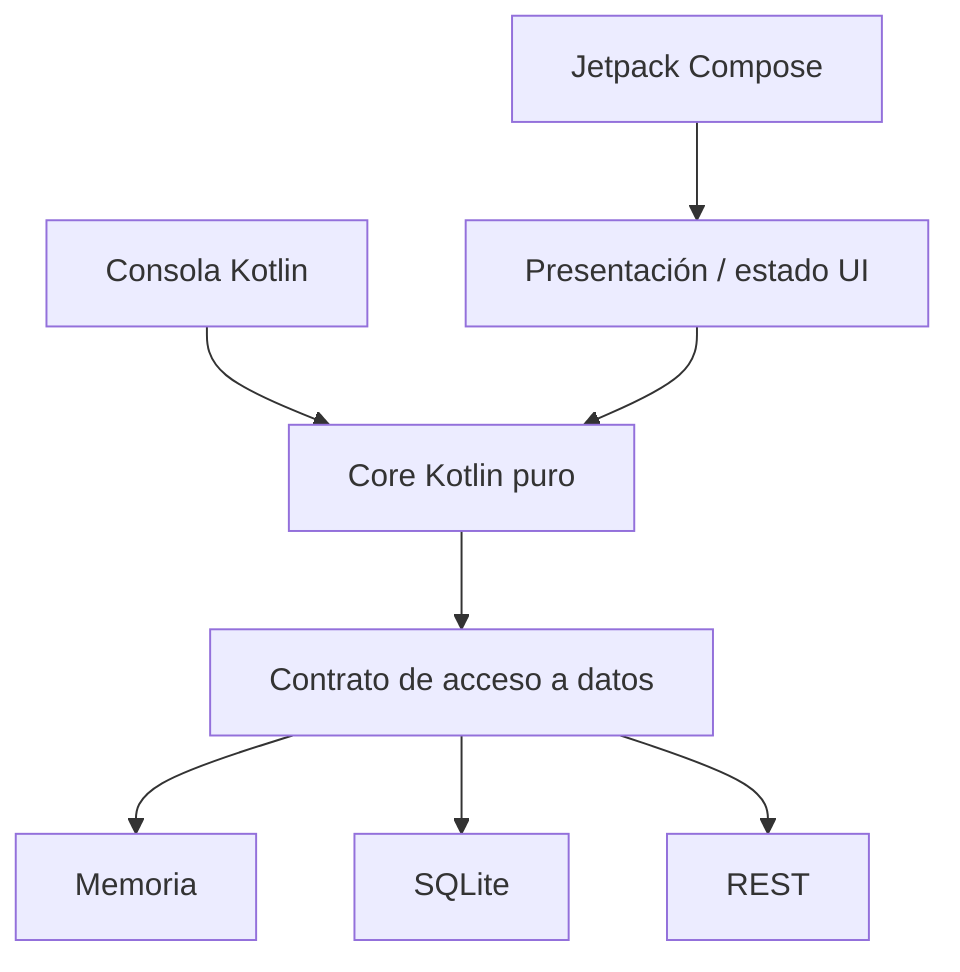
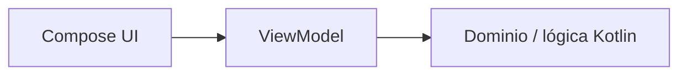
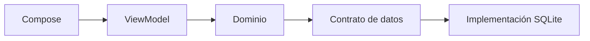
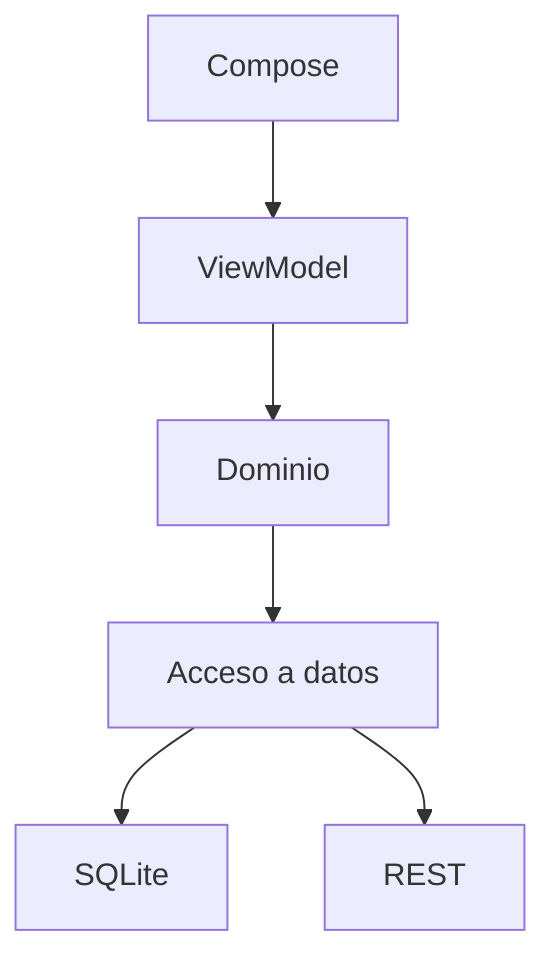

# PocketLog · Roadmap semanal hasta fin de curso

Este documento es la **guía docente de evolución de PocketLog** para DSY1105 durante el semestre 2026-2.

No reemplaza el cronograma institucional ni las guías de cada semana. Su función es mantener una dirección coherente para que el mismo software avance con el contenido real del curso y pueda alinearse posteriormente con el proyecto **Mobile-Compose**.

> **Regla principal:** el cronograma institucional y el avance real de la sección mandan. Este roadmap orienta; no autoriza a adelantar contenidos.

---

# 1. Principio de compatibilidad con Mobile-Compose

PocketLog debe evolucionar de manera que la lógica construida durante la **Unidad 1 y EV1 permanezca 100% en Kotlin de consola**, y recién después se reutilice cuando el curso entre formalmente a Android/Compose.

La dirección arquitectónica objetivo es:



Esta figura es una **dirección docente**, no una estructura que deba implementarse completa antes de que el contenido institucional llegue a Android.

## Contrato de compatibilidad

A medida que PocketLog crezca, se intentará preservar estas reglas:

1. **El dominio y las reglas de negocio usan Kotlin puro.**
2. **Hasta EV1, PocketLog se ejecuta exclusivamente como aplicación de consola.**
3. **El dominio no importa `android.*`, Compose, SQLite, Retrofit ni clases visuales.**
4. **La UI Android no aparece antes de la etapa móvil del curso.**
5. **La persistencia y la red se mantienen fuera del dominio cuando sean incorporadas.**
6. **Los modelos del dominio no se diseñan alrededor de widgets, JSON o tablas.**
7. **Los cambios de tecnología deberían afectar principalmente a capas externas.**
8. **La separación concreta de paquetes/módulos se introduce solo cuando el contenido de la asignatura la justifica.**

Cuando el proyecto Mobile-Compose esté disponible para inspección, este contrato debe reconciliarse con sus nombres reales de módulos, paquetes y convenciones sin alterar innecesariamente el dominio ya construido.

---

# 2. Regla de evolución semanal

Cada semana formativa sigue:

```text
checkpoint estable anterior
        ↓
contenido institucional de la semana
        ↓
problema visible en PocketLog
        ↓
concepto nuevo
        ↓
refactor/incremento guiado
        ↓
checkpoint nuevo
```

Cada clase real dentro de la semana deja además su propio estado de salida.

Las semanas de evaluación **pausan PocketLog**.

---

# 3. Mapa completo del semestre

## Semana 01 · 10–15 agosto

### Contenido institucional

- panorama del desarrollo de aplicaciones móviles;
- ecosistema, lenguajes y frameworks.

### PocketLog

Todavía no se construye formalmente.

Puede presentarse únicamente como contexto futuro:

> Durante el semestre construiremos una misma solución que comenzará como Kotlin de consola y, después de EV1, evolucionará hacia una aplicación móvil.

### No adelantar

- arquitectura;
- POO aplicada al proyecto;
- Android;
- Compose.

---

# Unidad 1 · Kotlin de consola

## Semana 02 · 17–22 agosto · PocketLog v0.2

### Contenido institucional

- fundamentos Kotlin;
- variables y tipos;
- operadores;
- entrada/salida cuando corresponda;
- condicionales;
- ciclos;
- funciones;
- colecciones;
- funciones de colecciones.

### Objetivo PocketLog

Construir la primera versión funcional **en consola y de forma procedural**.

### Evolución prevista por clases

#### Clase 1

```text
un registro
→ tipos explícitos
→ inferencia
→ val / var
→ concatenación
→ String templates
→ if explícito
→ if como expresión
→ varios registros
→ listas
→ ciclos
→ primera función
```

#### Clase 2

```text
checkpoint clase 1
→ filtrar manualmente
→ extraer función
→ filter/filterIndexed
→ contar manualmente
→ count
→ transformar manualmente
→ map
```

### Estado de salida

PocketLog puede:

- almacenar registros simples en memoria;
- listar;
- filtrar;
- contar;
- transformar datos para mostrar resúmenes.

### Deuda intencional

Los datos de un registro viven en listas paralelas.

### No adelantar

- clases propias;
- data classes;
- herencia;
- corrutinas;
- Android;
- MVVM;
- Repository.

---

## Semana 03 · 24–29 agosto · PocketLog v0.3

### Contenido institucional

- POO en Kotlin;
- control de errores;
- corrutinas;
- sintaxis Kotlin avanzada asociada a la unidad.

### Problema de entrada

Las listas paralelas son frágiles:

```text
titulos[0]
categorias[0]
completados[0]
```

representan una sola cosa, pero el lenguaje todavía no lo expresa como una unidad.

### Evolución PocketLog

#### Primer incremento · modelar el concepto

Comparar:

```text
listas paralelas
vs
Map<String, Any>
vs
clase que represente Registro
```

Llegar gradualmente a algo equivalente a:

```kotlin
data class Registro(...)
```

solo cuando el contenido ya haya presentado clases/data classes.

#### Segundo incremento · comportamiento y errores

Incorporar operaciones como:

- crear registro;
- cambiar estado;
- validar información;
- buscar por identificador.

Practicar manejo de errores con situaciones reales del dominio.

#### Tercer incremento · corrutinas

Usar corrutinas **solo en un caso didáctico coherente con el material institucional**, sin inventar todavía red, Android ni base de datos.

Por ejemplo, simular una operación que demora para observar ejecución suspendible.

### Estado de salida

La lógica deja de depender de listas paralelas y comienza a tener un modelo de dominio reconocible, **todavía dentro de una aplicación de consola**.

### Separación que conviene cuidar

Desde aquí, las funciones que representan reglas del dominio no deberían depender de `println` si pueden devolver un resultado neutral.

Ejemplo conceptual:

```text
mejor:
obtenerPendientes() → List<Registro>

que:
mostrarPendientes() → imprime directamente
```

Esto prepara reutilización futura sin introducir Android.

### No adelantar

- Activity;
- Compose;
- ViewModel;
- SQLite;
- Retrofit;
- Repository como obligación arquitectónica, salvo que aparezca justificadamente en el material real.

---

## Semana 04 · 31 agosto–5 septiembre · PocketLog v0.4

### Alcance de PocketLog

**PocketLog permanece en Kotlin de consola.**

Aunque el cronograma general pueda comenzar a introducir herramientas o contexto de Android en esta zona del semestre, la evolución formativa de PocketLog se mantiene deliberadamente dentro del alcance evaluable de **EV1: Kotlin consola**.

### Objetivo

Consolidar una aplicación de consola suficientemente completa para integrar los contenidos de Unidad 1 sin agregar tecnología nueva ajena a EV1.

### Evolución posible, según material realmente visto

- mejorar organización de funciones/clases;
- reforzar POO;
- incorporar validaciones y manejo de errores;
- aplicar sintaxis Kotlin avanzada ya estudiada;
- practicar colecciones y transformaciones;
- utilizar corrutinas únicamente si forman parte del alcance real de Unidad 1;
- mejorar el flujo de consola si ayuda a integrar lo aprendido.

### Criterio

La Semana 04 debe funcionar como **consolidación e integración**, no como anticipo de la Unidad móvil.

### Estado de salida

PocketLog v0.4 es la **última versión formativa de consola antes de EV1**.

Debe poder ejecutarse sin:

```text
Android Studio runtime
android.*
Compose
ViewModel
SQLite
Retrofit
```

### No adelantar

- Android aplicado a PocketLog;
- Compose;
- MVVM;
- persistencia móvil;
- navegación móvil.

---

## Semana 05 · 7–12 septiembre · EV1

### Alcance de evaluación

**Kotlin de consola. Android no forma parte de EV1.**

PocketLog se pausa como proyecto guiado durante la evaluación.

No se utiliza como plantilla ni dominio equivalente de la EV1.

Checkpoint estable de retorno: **PocketLog v0.4, Kotlin consola**.

Este hito divide explícitamente el semestre:

```text
Unidad 1
Kotlin consola
      ↓
EV1
      ↓
Unidad 2
Android / Compose
```

---

# Unidad 2 · Aplicación móvil con Android, Compose y MVVM

## Semana 06 · 14–19 septiembre · PocketLog v0.6

### Contenido institucional

- arquitectura y planificación colaborativa;
- configuración inicial del proyecto móvil con MVVM;
- componentes básicos de diseño visual;
- Jetpack Compose.

### Problema de entrada

Tenemos una aplicación funcional en Kotlin de consola que ya integró los aprendizajes de Unidad 1.

La nueva pregunta es:

> ¿Cómo llevamos esa misma lógica a una aplicación Android sin reescribir las reglas que ya funcionan?

### Primer hito móvil

**Aquí comienza formalmente la migración de PocketLog hacia Mobile-Compose.**

Se crea/configura la aplicación Android según el material institucional y se reutiliza el Kotlin puro de v0.4 cuando sea pertinente.

Dirección esperada:



Si el material institucional o Mobile-Compose utiliza una capa de datos/repositorio desde el inicio, se incorpora aquí con el mismo criterio.

### Responsabilidades

#### Presentación

- Composables;
- eventos de usuario;
- renderizado de estado;
- ViewModel.

#### Dominio / core

- `Registro`;
- reglas;
- operaciones reutilizables;
- modelos independientes de Android cuando sea razonable.

#### Datos

Todavía puede usar memoria si la persistencia real aún no corresponde.

### Estado de salida

PocketLog tiene por primera vez una UI Compose estructurada que consume lógica reutilizable proveniente de la etapa consola.

### No adelantar

- navegación si corresponde a Semana 07;
- SQLite;
- REST.

---

## Semana 07 · 21–26 septiembre · PocketLog v0.7

### Contenido institucional

- diseño visual profesional, jerárquico y adaptable;
- adaptabilidad;
- navegación estructurada.

### Evolución PocketLog

Mejorar la UI sin trasladar lógica de negocio a los Composables.

Agregar navegación coherente con el dominio, por ejemplo:

```text
Listado de registros
    ↓
Detalle
    ↓
Crear / editar
```

### Separaciones a reforzar

- navegación ≠ reglas del negocio;
- Composable ≠ almacenamiento;
- modelo visual puede diferir del modelo de dominio si llega a ser necesario.

### Estado de salida

Aplicación navegable y visualmente estructurada.

---

## Semana 08 · 28 septiembre–3 octubre · PocketLog v0.8

### Contenido institucional

- formularios;
- validaciones;
- componentes interactivos;
- paso de información entre pantallas.

### Evolución PocketLog

Crear/editar registros mediante formulario.

### Distinción didáctica importante

Separar:

```text
validación de presentación
"el campo está vacío"

vs

regla de dominio
"este cambio de estado no está permitido"
```

No toda validación debe vivir en el mismo lugar.

### Estado de salida

CRUD visual parcial con formularios y paso de información coherente.

---

## Semana 09 · 5–10 octubre · PocketLog v0.9

### Contenido institucional

- gestión de estado;
- persistencia/estado según material de la semana;
- animaciones;
- recursos nativos;
- cámara.

### Evolución PocketLog

#### Estado

Consolidar un modelo claro de estado de pantalla.

#### Animación

Agregar animaciones que respondan al estado sin mezclarlas con reglas del dominio.

#### Cámara

Permitir asociar una imagen a un registro.

### Separación crítica

El dominio **no debe depender de `Bitmap`, `Context`, Activity ni APIs Android**.

La capa Android resuelve la captura y entrega al resto del sistema una representación apropiada para el nivel de abstracción disponible en el curso.

### Estado de salida

PocketLog utiliza recursos nativos sin contaminar innecesariamente el núcleo reutilizable.

---

## Semana 10 · 12–17 octubre · PocketLog v0.10

### Contenido institucional

- persistencia avanzada con SQLite.

### Problema de entrada

Hasta ahora los datos desaparecen al reiniciar o utilizan una implementación temporal.

### Evolución PocketLog

Introducir persistencia SQLite conforme al enfoque institucional.

Esta semana debe hacer visible la diferencia entre:

```text
qué guardar
vs
cómo guardarlo
```

### Arquitectura esperada

Si aún no existe una abstracción de acceso a datos, esta es una necesidad natural para introducirla.



La nomenclatura concreta se alineará al material institucional/Mobile-Compose.

### Estado de salida

- datos sobreviven al reinicio;
- lógica principal no conoce SQL directamente;
- la implementación local queda reemplazable.

---

## Semanas 11–12 · 19–31 octubre · EP2

PocketLog se pausa.

Checkpoint estable de retorno: **v0.10**.

---

# Unidad 3 · Integración, calidad y distribución

## Semana 13 · 2–7 noviembre · PocketLog v0.13

### Contenido institucional

- consumo de servicios REST;
- conexión interfaz ↔ servicios de datos.

### Problema de entrada

PocketLog ya sabe obtener datos localmente.

Ahora aparece una segunda fuente:

```text
remota
```

### Evolución PocketLog

Incorporar consumo REST siguiendo la tecnología concreta del material institucional/Mobile-Compose.

### Separación esperada



No es obligatorio implementar sincronización sofisticada u offline-first si no corresponde al plan.

El foco es comprender:

```text
UI
→ solicitud de datos
→ capa de acceso
→ servicio HTTP
→ respuesta
→ estado UI
```

### Estado de salida

PocketLog consume al menos una operación remota sin acoplar la UI directamente al cliente HTTP.

---

## Semana 14 · 9–14 noviembre · PocketLog v0.14

### Contenido institucional

- pruebas unitarias;
- aseguramiento de calidad.

### Evolución PocketLog

Usar la separación construida durante el semestre para demostrar qué es fácil o difícil de probar.

### Prioridad de pruebas

1. reglas de dominio;
2. funciones/casos de uso;
3. ViewModel cuando corresponda;
4. componentes externos solo según alcance del contenido.

### Comparación didáctica

```text
código mezclado con Android/SQLite/HTTP
→ difícil de aislar

lógica Kotlin desacoplada
→ prueba rápida y controlada
```

### Estado de salida

Suite básica de pruebas que valida comportamientos significativos, no solo getters o trivialidades.

---

## Semana 15 · 16–21 noviembre · PocketLog v0.15

### Contenido institucional

- compilación segura;
- generación de APK;
- firma.

### Evolución PocketLog

No se agregan capacidades de negocio relevantes.

El proyecto se prepara como producto distribuible:

- build release;
- configuración necesaria;
- firma;
- APK;
- revisión de datos/configuración que no deban quedar expuestos.

### Estado de salida

PocketLog produce un APK firmado y reproducible conforme al contenido institucional.

---

## Semanas 16–17 · 23 noviembre–5 diciembre · EP3

PocketLog se pausa.

Checkpoint formativo final: **v0.15**.

---

## Semana 18 · 7–12 diciembre · EFT

PocketLog no debe transformarse en una guía de respuesta para la EFT.

Puede utilizarse únicamente como material histórico de repaso de conceptos ya estudiados cuando sea pertinente.

---

# 4. Evolución de las responsabilidades

La separación no aparece completa en Semana 02. Evoluciona con el conocimiento y respetando la frontera de EV1.

## Etapa A · Semanas 02–04

```text
Kotlin consola

main
+ funciones
+ modelo Kotlin
+ validaciones/errores
+ colecciones
+ POO
```

Meta silenciosa docente: evitar que reglas reutilizables queden inevitablemente amarradas a `println`/entrada de consola, pero **sin introducir Android**.

## Etapa B · EV1

```text
Kotlin consola únicamente
```

Hito de cierre de Unidad 1.

## Etapa C · Semana 06 en adelante

```text
presentation
    ↓
domain/core
    ↓
data
```

Solo cuando Android, MVVM y Compose ya forman parte del contenido.

## Etapa D · Semana 10

```text
data
├── local SQLite
└── implementación temporal anterior
```

## Etapa E · Semana 13

```text
data
├── local
└── remote REST
```

---

# 5. Regla para modelos

Conviene distinguir tres conceptos sin forzarlos antes de tiempo.

## Modelo de dominio

Representa el concepto de PocketLog.

```text
Registro
```

## Modelo de UI

Se introduce únicamente cuando la etapa Android/Compose lo necesite.

No existe antes de EV1 por anticipación arquitectónica.

## Modelo de persistencia/red

Se introduce cuando SQLite o REST requieran estructuras específicas.

Evitar que anotaciones, DTOs o detalles externos dicten el diseño de las reglas del dominio.

---

# 6. Regla de paquetes/módulos

No se debe imponer una estructura compleja durante Kotlin básico.

## Semanas 02–04

Estructura de consola simple y comprensible.

Puede evolucionar gradualmente hacia paquetes Kotlin cuando POO/organización lo justifiquen, pero no hacia módulos Android.

## Semana 06

Con arquitectura/MVVM ya en contenido, adoptar una estructura coherente con Mobile-Compose.

Dirección conceptual:

```text
presentation/
domain/
data/
```

pero **los nombres concretos se deben reconciliar con Mobile-Compose antes de fijarlos como estándar para alumnos**.

---

# 7. Qué debe revisarse antes de preparar cada semana

Antes de escribir una nueva guía PocketLog:

1. revisar el cronograma institucional;
2. revisar material institucional de esa semana;
3. revisar el alcance de la evaluación próxima;
4. revisar qué se alcanzó realmente en la clase anterior;
5. abrir el checkpoint actual de PocketLog;
6. identificar el problema que permitirá introducir el contenido nuevo;
7. comprobar que no estamos adelantando contenido posterior;
8. revisar compatibilidad con la dirección Mobile-Compose;
9. definir el estado de salida de cada clase;
10. recién entonces escribir la guía y el código nuevo.

---

# 8. Principio final

PocketLog debe poder contar al terminar el semestre una historia visible:

```text
"primero aprendí Kotlin construyendo una aplicación de consola"
        ↓
"cerré esa etapa en EV1"
        ↓
"después reutilicé esa lógica al entrar a Android/Compose"
        ↓
"incorporé persistencia, REST y pruebas sin partir de cero"
```

La arquitectura no se enseña como una receta adelantada. Se descubre progresivamente a medida que el proyecto y el plan de DSY1105 crean la necesidad de separar responsabilidades.
