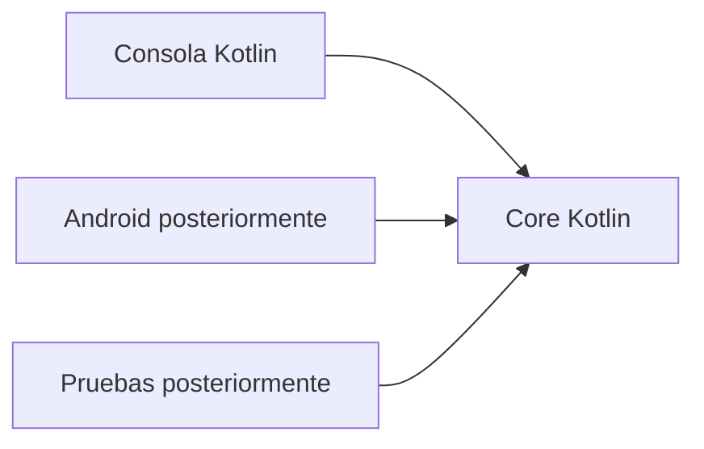

# Semana 2 · Programación de Kotlin y sus fundamentos

**Periodo:** 17 al 22 de agosto de 2026  
**Sección:** DSY1105-009V  
**Actividad institucional:** 1.2 Programación de Kotlin y sus fundamentos

← [Volver al índice](../README.md)

## Proyecto formativo transversal · PocketLog

Desde esta semana se inicia **PocketLog**, proyecto formativo que evolucionará durante todo el semestre.

La idea central es que el código Kotlin creado ahora en consola **no sea descartado cuando comencemos Android**. La lógica del dominio irá quedando progresivamente separada de quien la utiliza:



Esta semana no se enseña todavía toda la arquitectura. Primero construiremos comportamiento útil con Kotlin básico; en las semanas siguientes aparecerán POO, contratos, Android, persistencia y REST cuando exista una necesidad concreta para ellos.

- [Proyecto formativo · PocketLog](../../proyecto-formativo/README.md)
- [Diseño longitudinal del semestre](../../docs/PROYECTO-FORMATIVO-TRANSVERSAL.md)
- [Checkpoint Semana 02 · `PocketLog.kt`](../../proyecto-formativo/checkpoint-semana-02/PocketLog.kt)

## Objetivo semanal

Consolidar fundamentos de Kotlin mediante práctica incremental sobre PocketLog:

**Variables → Operadores → Condicionales → Ciclos → Funciones → Colecciones → `map` / `filter` → checkpoint reutilizable.**

## Contenidos oficiales

- **1.2.1** Programación en Kotlin y sus fundamentos.
- **1.2.2** Guía 2 – Aplicando Kotlin Básico.
- **1.2.3** Colecciones y funciones en Kotlin.
- **1.2.4** Guía 3 – Aplicando Colecciones.

## Patrón estándar de trabajo

Cada contenido importante se aborda con:

1. explicación breve;
2. ejemplo guiado ejecutable;
3. modificación de PocketLog;
4. práctica/laboratorio de transferencia;
5. evidencia y explicación de decisiones;
6. nuevo checkpoint reutilizable.

El tamaño puede ser diario o semanal según la magnitud del contenido, pero **la práctica no queda como actividad opcional al final de la teoría**.

## PocketLog esta semana

El checkpoint debe permitir manejar una colección en memoria de registros simples, por ejemplo:

```text
Registro
- id
- título
- categoría
- completado
```

Sobre esos datos se practicarán:

- `val` y `var`;
- tipos;
- String templates;
- `if` y `when`;
- iteraciones;
- funciones con parámetros y retorno;
- `List` / `MutableList`;
- `filter`;
- `map`;
- `count` u otras operaciones sencillas sobre colecciones.

> La `data class RegistroBasico` del checkpoint puede utilizarse como introducción ligera para agrupar datos, pero **POO como contenido formal se profundiza en Semana 03**. No se adelanta arquitectura por memorizar nombres.

## Material creado

### Material principal

- [Guía práctica · fundamentos Kotlin](./01-guia-kotlin-fundamentos.md)
- [PocketLog · checkpoint Semana 02](../../proyecto-formativo/checkpoint-semana-02/PocketLog.kt)
- [Proyecto formativo longitudinal](../../docs/PROYECTO-FORMATIVO-TRANSVERSAL.md)

### Material complementario

- [Ejemplo guiado · Productos](./ejemplos/Productos.kt) — ejemplo adicional de sintaxis y colecciones.
- [Laboratorio · Analizador de temperaturas](./laboratorio-temperaturas/README.md) — ejercicio de transferencia independiente; no constituye el hilo semestral.

## Hoy lunes 17 · 19:01–21:10

### Bloque 1 · 19:01–19:40

- `val` y `var`;
- inferencia de tipos;
- tipos básicos;
- `println`;
- String templates;
- conversiones simples/seguras.

**PocketLog:** definir los primeros datos de registros y mostrarlos por consola.

### Bloque 2 · 19:41–20:20

- operadores;
- `if`;
- `when`;
- `for` y rangos;
- `while`.

**PocketLog:** representar estados simples, recorrer registros y producir mensajes según cantidad/estado.

### Bloque 3 · 20:31–21:10

- funciones;
- parámetros y retorno;
- primera colección con `listOf` / `mutableListOf`;
- comenzar a extraer comportamiento repetido.

**Checkpoint parcial:** PocketLog puede listar registros y ejecutar al menos una operación encapsulada en función.

> `map`, `filter` y `MutableList` se profundizan el jueves. No se sacrifica la base por intentar cubrir toda la semana en tres bloques.

## Jueves 20 · 21:11–22:30

- `List` vs `MutableList`;
- mutabilidad/inmutabilidad;
- iteraciones;
- `map`;
- `filter`;
- `count` y transformaciones simples;
- consolidación de PocketLog;
- ejercicio independiente de transferencia.

**Checkpoint de salida:** una versión de PocketLog que pueda reutilizarse en Semana 03 para transformarla progresivamente desde código Kotlin básico hacia POO, manejo de errores y corrutinas.

## Evidencia mínima semanal

El estudiante debe poder:

1. elegir razonadamente entre `val` y `var`;
2. aplicar tipos y conversiones;
3. usar `if` y `when`;
4. implementar ciclos;
5. escribir funciones con parámetros/retorno;
6. trabajar con colecciones;
7. explicar `map` y `filter`;
8. ejecutar y modificar PocketLog;
9. resolver un ejercicio de transferencia sin copiar el ejemplo;
10. explicar qué parte del código será reutilizada la semana siguiente.

## Continuidad hacia Semana 03

No se comienza otro proyecto.

La próxima semana aparecerá la necesidad de ordenar mejor PocketLog:

```text
código con datos + funciones + colecciones
        ↓
modelo de objetos
        ↓
responsabilidades
        ↓
manejo de errores
        ↓
operaciones asíncronas cuando corresponda
```

Así POO y corrutinas se incorporarán **porque PocketLog las necesita**, no como temas desconectados.

## Material institucional

- [Biblioteca pública](https://drive.google.com/drive/folders/1_Ew_IE0InqJbPY0Ggu8p0cHl4Avv3rYs?usp=sharing)
- [Semana 02 en Drive](https://drive.google.com/drive/folders/1dNgCNnnCU5aURfT_5qlU7NH9RQYNe8bj)

El puente Java → Kotlin de Semana 01 sigue disponible como apoyo cuando una comparación ayude, pero la prioridad esta semana es escribir y razonar directamente en Kotlin.
